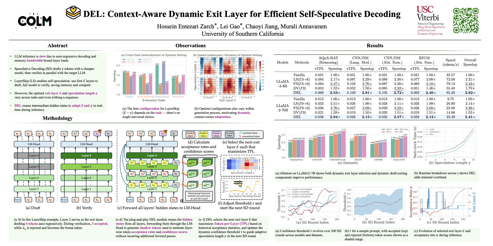
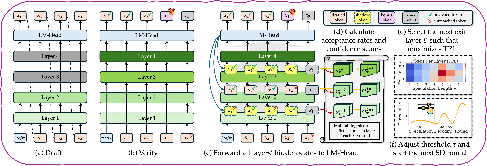

<div align="center">
<h1>&nbsp;DEL: Context-Aware Dynamic Exit Layer for Efficient Self-Speculative Decoding</h1></div>

<p align="center">
<a href="https://arxiv.org/abs/2504.05598">
  </a> 
<a href="https://opensource.org/licenses/Apache-2.0">
  </a> 
<a href="https://github.com/hoenza/DEL/pulls">
    </a>
</p>

## Poster

<p align="center">
  
</p>

<p align="center">
  <a href="assets/DEL-CoLM.pdf">Download PDF</a>
</p>

## Introduction

**DEL** is a *plug-and-play self-speculative decoding algorithm* that dynamically selects both the **exit layer** and **speculation length** during LLM inference to maximize throughput. Unlike prior methods that rely on fixed hyperparameters or offline tuning, DEL uses real-time token acceptance signals to adaptively configure the draft model for each input.

DEL builds on **LayerSkip**, a self-speculative framework that reuses the early layers of the target model to generate draft tokens. DEL enhances this method by introducing:

- **Token-per-Layer (TPL)**: A metric that balances acceptance rate and computation cost to guide exit layer selection.
- **Shadow Token Analysis**: Efficient use of cached hidden states to estimate acceptance probabilities for all exit layers simultaneously.
- **Dynamic Draft Exiting**: A confidence-driven mechanism that determines when to stop drafting tokens, even mid-round.

These components allow DEL to perform on-the-fly optimization of speculative decoding parameters for each prompt and context window.



---

## 🔧 Installation

```bash
# Setup Conda environment
conda create --name del python=3.10
conda activate del

# Install dependencies
pip install -r requirements.txt
```

---

## 🚀 Reproduce Main Results

Run the full benchmark suite using:

```bash
bash run_benchmarks.sh
```

This script evaluates DEL and several baselines (`self_speculative`, `FSM_speculative`, `DV_speculative`, `autoregressive`) across 7 datasets and multiple LayerSkip LLaMA variants.

- Logs will be saved under `./logs/`
- You can modify `run_benchmarks.sh` to adjust `num_samples`, `max_steps`, or target models.

---

## 📁 Project Structure

```
.
├── benchmark.py                # Main benchmarking entry point
├── arguments.py                # Argument parser for benchmarking and generation
├── generate.py                 # Generation script for non-benchmarking use
├── eval.py                     # Evaluation and scoring utilities
├── correctness.py              # Unit-level checks for speculative correctness
├── sweep.py                    # Hyperparameter sweep support
├── utils.py                    # Miscellaneous utilities
├── run_benchmarks.sh           # Shell script to reproduce all benchmarks
├── requirements.txt
├── README.md
└── self_speculation/           # All generation strategies implemented here
    ├── DEL.py                           # Dynamic Exit Layer (DEL) core logic
    ├── DEL_speculation_generator.py     # DEL-based generation
    ├── DV_speculation_generator.py      # Draft&Verify speculative decoding baseline
    ├── DELE_speculation_generator.py    # DEL without dynamic draft exiting variant
    ├── FSM_speculation_generator.py     # FSM speculation baseline
    ├── autoregressive_generator.py      # Vanilla greedy decoding
    ├── self_speculation_generator.py    # Standard self speculative decoding
    ├── generator_base.py                
    ├── llama_model_utils.py             
    └── speculative_streamer.py          
```

---

## 📊 Datasets and Models

We benchmark DEL using:

**Models**
- `facebook/layerskip-llama3.2-1B`
- `facebook/layerskip-llama3-8B`
- `facebook/layerskip-llama2-[7B,13B,70B]`

**Datasets**
- `gsm8k`, `aqua_rat` (math reasoning)
- `cnn_dm_lm`, `cnn_dm_summarization`, `xsum_summarization` (long-form/text)
- `wmt14_de_en` (translation)
- `human_eval` (code generation)

---

## 🧠 Key Features

- **DEL: Dynamic Exit Layer**  
  A plug-and-play module for LayerSkip that dynamically selects the exit layer and speculation length per generation round based on real-time context.

- **Context-Aware Adaptation**  
  Tracks token-level acceptance rates across layers and uses a confidence-aware thresholding mechanism to adapt speculation dynamically.

- **Token-per-Layer (TPL) Optimization**  
  Introduces a novel efficiency metric, TPL, to guide the optimal choice of exit layer and speculation length with negligible overhead.

- **Shadow Token Analysis**  
  Computes expected acceptance rates using cached hidden states and shadow tokens, without any additional forward passes through the model.

- **Streaming & Scalability**  
  Efficient across diverse tasks (reasoning, summarization, code) and scales from 1B to 70B LLMs, with up to **2.84× speedup** over greedy decoding.

- **Fully Compatible with LayerSkip**  
  Seamlessly integrates with early-exit models without any retraining or architectural changes.

- **Lightweight & Practical**  
  Adds minimal runtime and memory overhead (~1–2%), making it suitable for real-world deployment.

---

## 📄 Cite Us

If you use DEL in your work, please cite:

```bibtex
@inproceedings{entezari2025del,
  title={DEL: Context-Aware Dynamic Exit Layer for Efficient Self-Speculative Decoding},
  author={Entezari Zarch, Hossein and Gao, Lei and Jiang, Chaoyi and Annavaram, Murali},
  booktitle={Proceedings of the Conference on Language Modeling (COLM) 2025},
  year={2025}
}
```
---

## 🤝 Acknowledgements

- LayerSkip models provided by [Meta AI](https://github.com/facebookresearch/LayerSkip).
